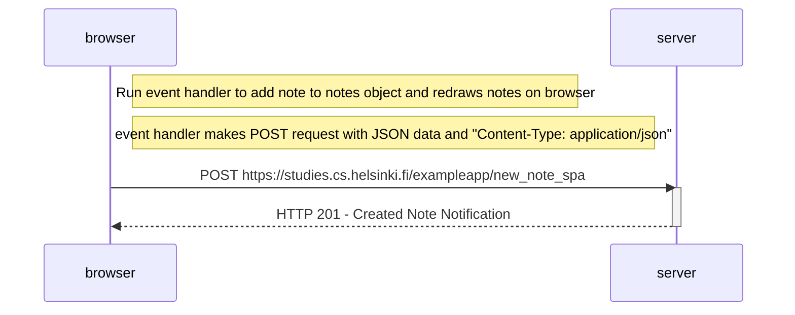

```mermaid
sequenceDiagram
    participant browser
    participant server

    Note right of browser: Run event handler to add note to notes object and redraws notes on browser

    Note right of browser: event handler makes POST request with JSON data and "Content-Type: application/json"
    
    browser->>server: POST https://studies.cs.helsinki.fi/exampleapp/new_note_spa
    activate server
    server-->>browser: HTTP 201 - Created Note Notification
    deactivate server
```